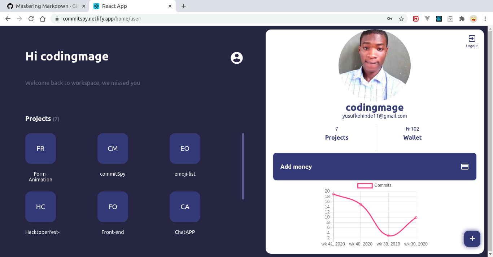
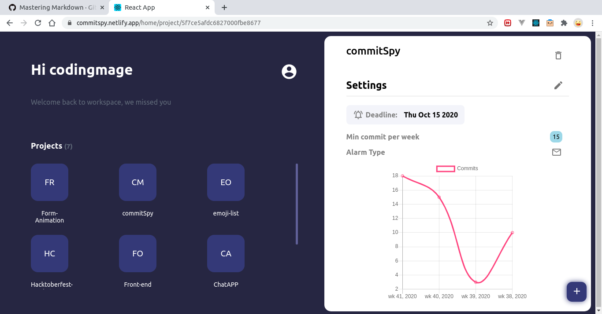
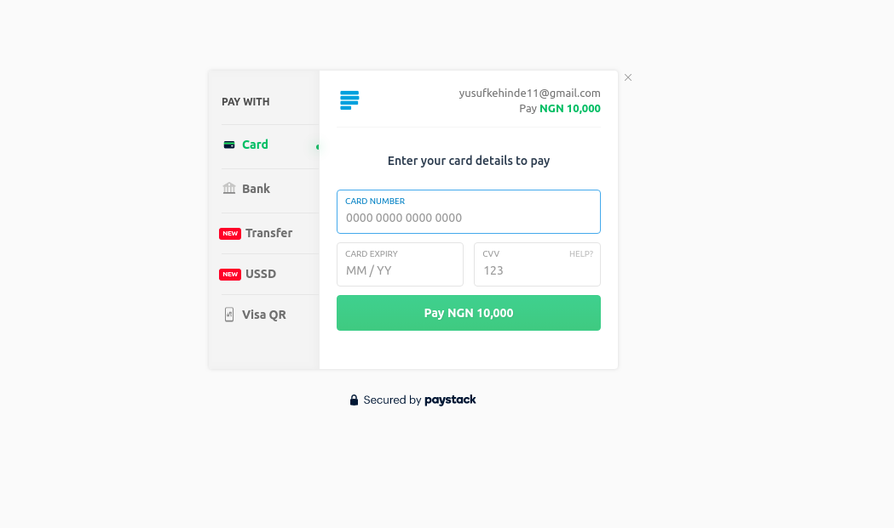

# commit-spy
This is a [Moleculer](https://moleculer.services/)-based microservices project. Generated with the [Moleculer CLI](https://moleculer.services/docs/0.14/moleculer-cli.html). This project works with several other apps to monitor a users github commits and punishes the user (via alert mail or tweet and/or deduction from the users wallet) when the user fails to  fufil his preset commit goals in the preset time. [The project can be found here](https://commitspy.netlify.app)

## Usage
Start the project with `npm run dev` command. 
After starting, open the http://localhost:3000/ URL in your browser. 

## Services
- **api**: API Gateway services
- **users**: User Service.
- **project**: Project Service responsible for project based actions and methods.
- **payment**: Payment Service is for initializing Payment requests and updating wallet from webhook.
- **notification**: notification Service for mailing users and sending Tweets(TBD).

## Images

## Useful links

* Moleculer website: https://moleculer.services/
* Moleculer Documentation: https://moleculer.services/docs/0.14/

